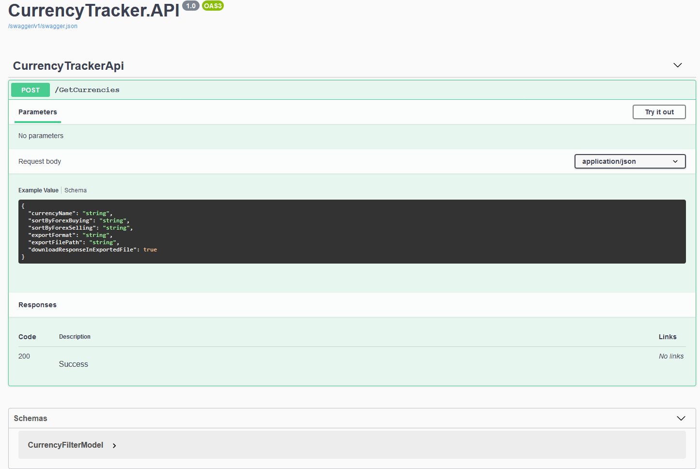

# CurrencyTraker API provide service to get info about live currency  
## the project developed with dotnet 5.0 and c# programming language
## Overview:
- Setting Up CurrencyTracker.API Project
- Setting Up Swagger third party lib
    >Swagger for play with endpoints, no need postman to play with endpoints
- Swagger UI in the below
    -  Click Try it out and start play 

- The Project have only one endpoint to done all work given in Case documentation
	- There is filtering option by CurrencyName 
	- There is sorting asc/desc option by ForexBuying 
	- There is also sorting asc/desc option by ForexSelling 
	- There is exportFormat option supports csv, excell, xml formarts 
	- There is exportFilePath option to save the results 
	- There is donwloadResponseInExportedFormat option give you filtered/sorted result in downloadable results 
